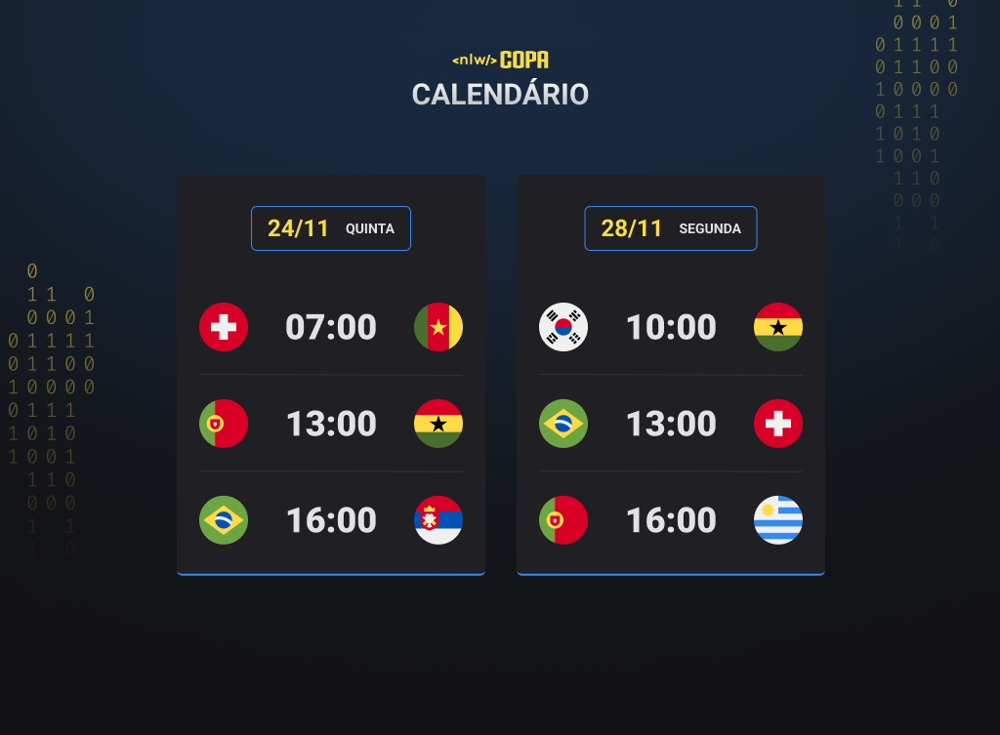

# Explorer_Lab
Meu projeto de agenda de jogos realizado durante o NLW copa da Rocketseat

<h1 align="center"> NLW #10 Copa </h1>

Evento exclusivo e gratuito, promovido pela Rocketseat para ensino de tecnologias WEB.

  <a href="#-tecnologias">Tecnologias</a>&nbsp;&nbsp;&nbsp;|&nbsp;&nbsp;&nbsp;
  <a href="#-projeto">Projeto</a>&nbsp;&nbsp;&nbsp;|&nbsp;&nbsp;&nbsp;
  <a href="#-layout">Layout</a>&nbsp;&nbsp;&nbsp;|&nbsp;&nbsp;&nbsp;
  <a href="#memo-licença">Licença</a>

  

 

  

## 🚀 Tecnologias

Esse projeto foi desenvolvido com as seguintes tecnologias:

- HTML e CSS
- JavaScript 
- Git e Github

## 💻 Projeto

O Calendário da copa é um projeto que mostra os jogos da Copa de 2022.

Visualize o projeto por aqui: https://explorerlab-sooty.vercel.app/

## 🔖 Layout

Você pode visualizar o layout do projeto através [DESSE LINK](https://www.figma.com/file/WvOln6XSqH3q1oq6x1JDYp/Calend%C3%A1rio-de-Jogos-(Community)?node-id=122%3A130). É necessário ter conta no [Figma](https://figma.com) para acessá-lo.

## :memo: Licença

Esse projeto está sob a licença MIT.

---
## Contato

Feito com ❤️ por [M. Ester](https://github.com/stehmorais)!  
🛠 FrontEnd Developer Jr.  
📍 Araras - Brasil   

&nbsp;
&nbsp;
&nbsp;

 